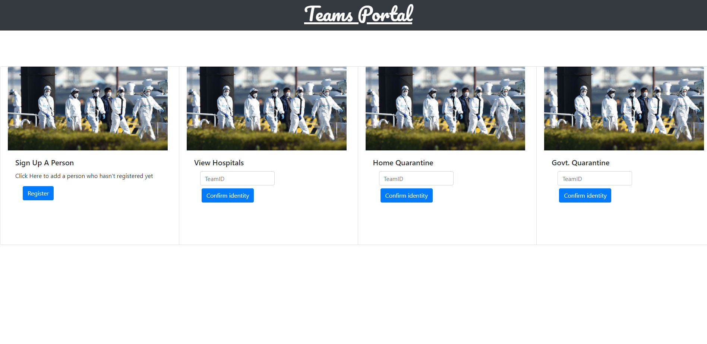
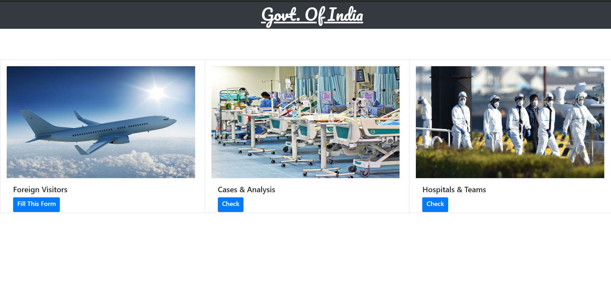

#                              Corona Management System
Corona Management System is capable of managing each and every data regarding Corona Patients , Doctors , Hospitals , Home Quarantined People ,  etc. Corona Management System helps Government and other concerned authorities in making effective policies because of proper flow of information from ground reality to higher levels .

Sql commands needed to build our project is also provided ( sql commands.docx ) .

## Technology used are :
Front End : HTML , CSS , JAVASCRIPT , Java Server Pages (JSP) .
Back End : Database(MySQL) , JAVA. IDE used : Eclipse.

### Home Page :

 
### HOSPITAL's PORTAL :

### DOCTOR's PORTAL :

### SUSPECTED PATIENT TRACKING DEDICATED TEAM's PORTAL :

### INDIAN CITIZEN's PORTAL :

### GOVT's PORTAL :

